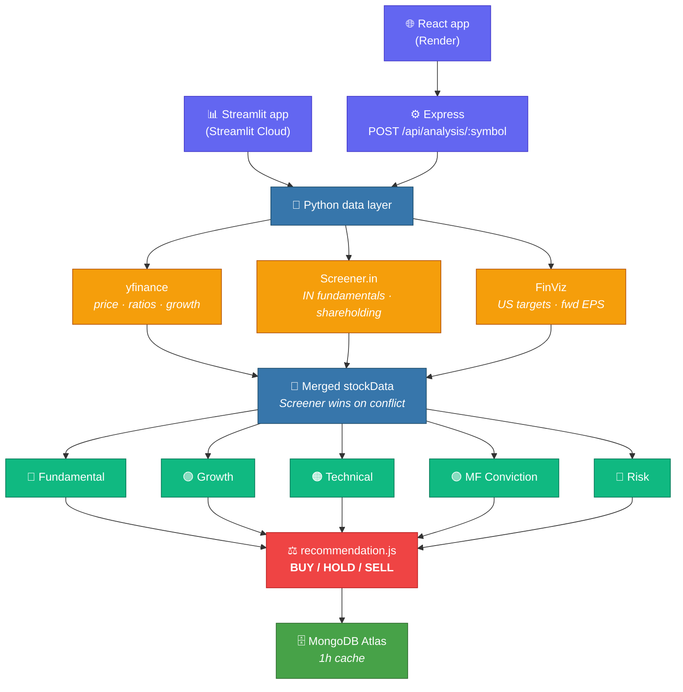

<div align="center">

# 📈 FinAI — Financial AI Agents

### Five independent scoring engines. One BUY / HOLD / SELL. All the working shown.

[](https://finai-stock-analysis.streamlit.app/)
[](https://github.com/SaiSatyaJagannadh/FinAI)

[](https://www.python.org/)
[](https://nodejs.org/)
[](https://react.dev/)
[](https://streamlit.io/)
[](https://www.mongodb.com/atlas)
[](https://www.langchain.com/)
[](https://build.nvidia.com/)
[](https://www.docker.com/)
[](#-testing)
[](#-license)

**🇮🇳 NSE / BSE** &nbsp;·&nbsp; **🇺🇸 US markets** &nbsp;·&nbsp; **No signup required**

</div>

> [!WARNING]
> **Educational tool — not investment advice.** The projections are mechanical extrapolations
> (current price grown at a source's growth rate, constant P/E assumed), not forecasts.
> Always read the primary filings, which the app links for every stock.

---

## 🎯 What makes it different

Most screeners hand you a single number and expect trust. FinAI shows its work — and disagrees
with itself in public when the engines don't line up.

| | Typical screener | **FinAI** |
|---|---|---|
| **Verdict** | One opaque score | 🟢 Five separate scores + the blend, so you see *which* pillar is dragging |
| **Benchmarks** | One global average | Per-sector benchmarks — an IT company's 25x P/E isn't judged like a bank's |
| **Data sourcing** | Single vendor feed | 3 sources cross-merged; Screener.in **overrides** stale yfinance ratios |
| **Failure mode** | Blank page or a lie | Best-effort enrichment — a scraper timeout degrades output, never fails the request |
| **Ownership flows** | Rarely shown | Promoter / FII / DII stake **and quarterly deltas** — informed money's direction |
| **Horizon** | Today's snapshot | Year-wise 1Y–10Y paths under bull / base / bear growth scenarios |
| **Moat** | Not modelled | Explicit economic-moat checklist + sector CAGR outlook |
| **AI chat** | Bolted-on generic bot | Assistant preloaded with *your analyzed stock's* full scoring context |
| **Trust** | "Trust the model" | Every response reports `dataSources` — you always know live vs. fallback |

The one I'm proudest of: **two completely different frontends (React and Streamlit) share the same
scoring engine, and a test asserts both paths produce identical output.** That parity test has
caught more real bugs than anything else in the repo.

---

## 🧮 The five engines

| Engine | Weight | What it reads |
|---|:---:|---|
| 🔵 **Fundamental** | `25%` | P/E (trailing & forward), PEG, P/B, ROE, ROA, margins, debt-to-equity, current ratio — each scored against its **sector's** benchmark |
| 🟣 **Growth** | `25%` | YoY + QoQ revenue, profit, EPS, book-value and dividend growth; last 8 quarters; consistency and sustainability |
| 🟠 **Technical** | `20%` | RSI, MACD, SMA/EMA trend, Bollinger Bands, volume trend, support/resistance |
| 🟢 **MF Conviction** | `15%` | Promoter / FII / DII / MF shareholding % and quarterly change — accumulation vs. distribution |
| 🔴 **Risk** | `15%` | Beta, volatility, leverage, interest coverage, liquidity, sector, geopolitical and disruption risk |

All five are **higher = better** (including risk, where a higher score means safer — no inversion
anywhere). `recommendation.js` blends them at the weights above into the final call, target price
and stop-loss.

Plus: **Growth Projection** (1Y–10Y price paths), **Moat & Sector** (checklist + CAGR outlook),
and a **sidebar AI assistant**.

---

## 🏗️ Architecture

One HTTP request fans out across two languages and three data sources:



**Why two frontends?** The React app is the full product; the Streamlit app is a zero-friction
public demo. Both call the *same* five Node services — Streamlit shells out to
`server/services/analysisRunner.js`, a dependency-free stdin→stdout runner that shares
`recommendation.js` with the Express route. `tests/analysisRunner.parity.test.js` keeps them honest.

---

## 🧰 Tech stack

<table>
<tr><th align="left">Layer</th><th align="left">Tools</th><th align="left">Why this one</th></tr>
<tr>
  <td>🐍 <b>Data</b></td>
  <td><code>yfinance</code> · <code>BeautifulSoup4</code> · <code>lxml</code> · <code>pandas</code></td>
  <td>yfinance is free and global; Screener.in has Indian shareholding no API sells cheaply, so it's scraped</td>
</tr>
<tr>
  <td>⚙️ <b>Scoring</b></td>
  <td><code>Node.js</code> · plain JS modules</td>
  <td>Pure functions, no framework — which is exactly why the same files run under both Express and Streamlit</td>
</tr>
<tr>
  <td>🌐 <b>API</b></td>
  <td><code>Express</code> · <code>Mongoose</code> · <code>JWT</code> · <code>bcryptjs</code></td>
  <td>Boring and battle-tested; rate limiter is hand-rolled (12 lines) rather than a new dependency</td>
</tr>
<tr>
  <td>⚛️ <b>Web UI</b></td>
  <td><code>React 18</code> · <code>React Router</code> · <code>Axios</code></td>
  <td>Component-per-analysis-tab maps 1:1 onto the five engines</td>
</tr>
<tr>
  <td>📊 <b>Demo UI</b></td>
  <td><code>Streamlit</code></td>
  <td>Full second frontend in ~1000 lines, deploys on push, no build step</td>
</tr>
<tr>
  <td>🤖 <b>AI chat</b></td>
  <td><code>LangChain</code> · <code>NVIDIA NIM</code> (<code>nemotron-3-super-120b</code>) · <code>Tavily</code> · <code>LangSmith</code></td>
  <td>NIM is OpenAI-wire-compatible, so switching providers is a <code>base_url</code> swap, not a rewrite — the agent gets live scoring context injected, Tavily covers anything post-cutoff, LangSmith traces every call</td>
</tr>
<tr>
  <td>🗄️ <b>Storage</b></td>
  <td><code>MongoDB Atlas</code></td>
  <td>Schema-loose responses cache cleanly as documents; 1h TTL per stock</td>
</tr>
<tr>
  <td>🚀 <b>Deploy</b></td>
  <td><code>Docker</code> · <code>Render</code> · <code>Streamlit Cloud</code></td>
  <td>One Docker service serves API + built React; Streamlit auto-redeploys from <code>main</code></td>
</tr>
<tr>
  <td>🧪 <b>Tests</b></td>
  <td><code>Jest</code> · <code>Streamlit AppTest</code></td>
  <td>Scoring, cross-runtime parity, rate limiting, and a live end-to-end smoke</td>
</tr>
</table>

---

## 📡 Data sources

| Source | Provides | Coverage |
|---|---|---|
| 🟪 **yfinance** | Price history, valuation ratios, growth, analyst mean target | Global |
| 🟩 **Screener.in** | Fundamentals + promoter/FII/DII shareholding (consolidated pages) | 🇮🇳 NSE / BSE |
| 🟦 **FinViz** | Analyst targets, forward & 5Y EPS estimates | 🇺🇸 US |

Screener and FinViz are **best-effort enrichment** — they overwrite yfinance only where they return
a truthy value, and a failure degrades the response instead of breaking it. Every response reports
its `dataSources`, so a fallback is never mistaken for a live feed.

---

## 🔐 Security & cost controls

The public demo runs on **personal API credits**, so both surfaces are throttled:

| Surface | Limit |
|---|---|
| 🤖 Streamlit AI chat | 15/hr per visitor · 120/hr app-wide · 500-char questions · `max_tokens=700` |
| 📊 Streamlit analyze | 25/hr per visitor · 300/hr app-wide |
| 🌐 Node `/api/*` | 60 requests / 15 min per IP |
| 🔑 Node `/api/auth` | 10 / 15 min per IP — makes password guessing impractical |

Also: no default admin account (seeded only when `ADMIN_PASSWORD` is set), `execFile` instead of
`exec` with regex-validated symbols so user input never reaches a shell, bcrypt-hashed passwords,
64 KB request body cap, and identical error text for unknown-user vs. wrong-password so the API
doesn't leak which accounts exist.

---

## 🚀 Getting started

**Prerequisites** — Node.js 16+, Python 3.10+, MongoDB (local or Atlas)

```bash
git clone https://github.com/SaiSatyaJagannadh/FinAI.git
cd FinAI

# JS deps (root + client)
npm install && npm install --prefix client

# Python deps
python3 -m venv .venv && source .venv/bin/activate && pip install -r requirements.txt
```

Create `server/.env`:

```bash
MONGODB_URI=mongodb://localhost:27017/financialai
JWT_SECRET=<any long random string>
ADMIN_PASSWORD=<optional; only set if you want an admin account seeded>
NVIDIA_API_KEY=<optional; enables the AI chat — free credits at build.nvidia.com>
OPENAI_API_KEY=<optional; used only if NVIDIA_API_KEY is absent>
TAVILY_API_KEY=<optional; enables live web search in the chat>
```

The chat picks its provider at runtime: **NVIDIA if `NVIDIA_API_KEY` is set, otherwise OpenAI,
otherwise it disables itself with a note** rather than erroring. The sidebar shows which model is
live. Model choice wasn't a guess — the account's 102 reachable models were probed for tool-calling
support (the agent needs it for search) and latency; `nemotron-3-super-120b-a12b` returned a tool
call in ~3s, while the 550B ultra took ~23s and several others don't support tools at all.

**Run it:**

```bash
npm run dev                              # React (3000) + Express (5000)
.venv/bin/streamlit run streamlit_app.py # Streamlit demo (8501)
```

**Debug the data layer directly** — fastest way to chase a bad number:

```bash
.venv/bin/python3 services/stockDataService.py INFY --exchange NSE --period 1y --json
.venv/bin/python3 services/screenerService.py INFY --json
.venv/bin/python3 services/finvizService.py AAPL --json   # US only
```

---

## 🧪 Testing

```bash
npm test                                        # Jest — scoring, runner parity, projections, rate limiting
.venv/bin/python3 tests/test_streamlit_app.py   # live end-to-end smoke
```

| Suite | Covers |
|---|---|
| `scoringServices.test.js` | The five engines' scoring maths |
| `analysisRunner.parity.test.js` | **Streamlit output == Express output** |
| `projectionMoat.test.js` | Year-wise projections + moat checklist |
| `rateLimit.test.js` | Limits, window expiry, per-IP isolation |
| `test_streamlit_app.py` | Full app against live yfinance/Screener/FinViz |

> A Yahoo `429` in the smoke test is an environment flake, not a bug.

---

## 🌍 Deployment

<table>
<tr><th align="left">Target</th><th align="left">What ships</th></tr>
<tr>
  <td>🟦 <b>Render</b></td>
  <td>One Docker service — Node builds the React app and Express serves the static bundle.
      Python deps come from the trimmed <code>requirements-deploy.txt</code>. Blueprint reads <code>render.yaml</code>.</td>
</tr>
<tr>
  <td>🟥 <b>Streamlit Cloud</b></td>
  <td><code>streamlit_app.py</code> from <code>main</code>, auto-redeploying on push.
      Root <code>requirements.txt</code> + <code>packages.txt</code> (apt-installs nodejs so the scoring engine runs).</td>
</tr>
</table>

Both need `MONGODB_URI`, and Atlas **Network Access** must allow `0.0.0.0/0`.

```bash
docker build -t finai .
docker run -p 5000:5000 -e MONGODB_URI="<atlas uri>" finai   # http://localhost:5000
```

> Render's free tier sleeps after 15 min idle — the first request back takes ~1 min.

---

## 📡 API reference

| Method | Endpoint | Purpose |
|:---:|---|---|
| `POST` | `/api/analysis/:symbol` | Full five-engine analysis (`{ exchange, forceRefresh }`) |
| `GET` | `/api/analysis/:symbol/history` | Past analyses for a stock |
| `GET` | `/api/stocks/:symbol` | Stock metadata |
| `GET` | `/api/stocks?search=:query` | Symbol search |
| `POST` | `/api/stocks/batch` | Several stocks at once |
| `POST` | `/api/auth/register` · `/api/auth/login` | Accounts (returns a JWT) |
| `GET` `POST` | `/api/portfolio` | List / create portfolios |
| `GET` | `/api/portfolio/:id` | One portfolio |
| `POST` `DELETE` | `/api/portfolio/:id/stocks[/:stockId]` | Add / remove holdings |
| `PUT` | `/api/portfolio/:id/allocate` | Update allocation |
| `GET` | `/api/health` | Health check |

---

## 📁 Project structure

```
FinAI/
├── 🐍 services/                    # Python data layer
│   ├── stockDataService.py         #   yfinance — price, ratios, growth, history
│   ├── screenerService.py          #   Screener.in scraper (IN fundamentals + shareholding)
│   ├── finvizService.py            #   FinViz scraper (US targets, forward EPS)
│   └── sector_map.py               #   free-form sector → canonical benchmark key
├── ⚙️ server/
│   ├── services/                   # ← the five scoring engines + recommendation.js
│   │   └── analysisRunner.js       #   stdin→stdout runner Streamlit calls
│   ├── routes/ · models/           # Express routes, Mongoose schemas
│   ├── rateLimit.js                # dependency-free per-IP limiter
│   └── server.js
├── ⚛️ client/src/                   # React app — one component per analysis tab
├── 📊 streamlit_app.py             # second full frontend + AI chat
├── 🧪 tests/                        # Jest suites + Streamlit AppTest smoke
└── 🐳 Dockerfile · render.yaml      # Render deployment
```

---

## 📊 Analysis methodology

<details>
<summary><b>🔵 Fundamental (25%)</b></summary>

- **Valuation** — P/E (trailing & forward), PEG, P/B
- **Profitability** — ROE, ROA, profit & operating margins
- **Financial health** — debt-to-equity, current ratio, interest coverage
- Every metric scored against its **sector's** benchmark, not a global average
  (`sector_map.py` normalizes free-form vendor strings like "Technology Services" → `IT_Services`)
</details>

<details>
<summary><b>🟣 Growth (25%)</b></summary>

- **Historical** — QoQ and YoY revenue, profit, EPS, book value, dividends
- **Quality** — consistency and sustainability, not one good quarter
- **Projections** — forward estimates, blended with analyst targets where available
</details>

<details>
<summary><b>🟠 Technical (20%)</b></summary>

- **Trend** — SMA / EMA crossovers
- **Momentum** — RSI, MACD
- **Volatility** — Bollinger Bands
- **Volume** — trend vs. average
- **Levels** — support / resistance identification
</details>

<details>
<summary><b>🟢 MF Conviction (15%)</b></summary>

- Promoter / FII / DII / MF holding percentages and **quarter-on-quarter deltas**
- Accumulation vs. distribution read
- Sourced from Screener.in shareholding — the only real feed for this tab
</details>

<details>
<summary><b>🔴 Risk (15%, higher = safer)</b></summary>

- **Market** — beta, volatility, correlation
- **Credit** — debt levels, interest coverage
- **Liquidity** — trading volume
- **Operational** — ROE, ROA, margin stability
- **Sector · Geopolitical · Disruption** — industry factors, FX exposure, obsolescence risk
</details>

---

## 📄 License

MIT — see [LICENSE](LICENSE).

## 🙏 Acknowledgments

Fundamental principles from Warren Buffett, Peter Lynch and Ray Dalio · technical methodology from
John Murphy and Alexander Elder · data from **yfinance**, **Screener.in** and **FinViz** · and the
open-source libraries that made a two-language pipeline a weekend problem instead of a quarter's.

<div align="center">

---

**[▶ Try the live app](https://finai-stock-analysis.streamlit.app/)** &nbsp;·&nbsp;
**[⭐ Star on GitHub](https://github.com/SaiSatyaJagannadh/FinAI)** &nbsp;·&nbsp;
**[✉️ Contact](mailto:saijagannadh0625@gmail.com)**

Built by **Sai Jagannadh** · Educational tool, **not investment advice**

</div>
